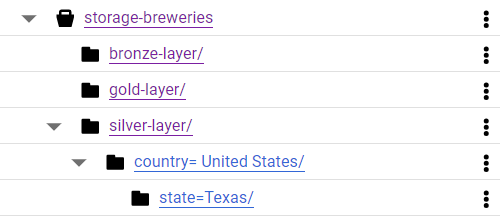

# Architecture and processes

## Data Lake

The Data Lake follows a medallion architecture, defined as:

**Bronze Layer**: Raw data from the API in its native format.
**Silver Layer**: Data in parquet format, partitioned by brewery location and with minor cleanups such as:
- Definition of a standard schema, if there are missing required columns;
- Transformation of null values to "N/A";
- Removal of duplicates.

**Gold Layer**: Aggregated data with the quantity of breweries per type and location (country and state).

**Google Cloud Storage**
The Data Lake uses Google Cloud Storage, based on the NoSQL format:

## Tasks

The tasks are structured so that their entire flow is organized into well-defined functions and called from the `execute` flow function. All functions have docstrings explaining their operation, parameters, and returns.

**landing_task**
Task for capturing data from the API.
For this task, the paginated endpoint was used to capture all registered breweries.

**Transform_task**
Task for data cleaning and transformation.
In this task, data is read from the original format, essential columns are created if they do not exist, duplicates are removed by ID, and null values are transformed into "N/A".

**business_task**
Task for injecting possible business rules into the data.
In this task, data is aggregated by location (country and state), summing up its quantity.

## Plugins

Helper functions are created and organized in the plugin folder to ensure potential scalability in the `airflow` environment, keeping these auxiliary tools more generic in the project and not tied to any specific DAG.

**gcs_buckets**
Helper functions for folder formatting, file listing, and saving.

**logging_config**
Helper function for log configuration.

**spark_config**
Helper function for configuring spark sessions.

## Visualization

A simple dashboard was created for visualizing the generated data, which is also why all brewery records were chosen to be included.
