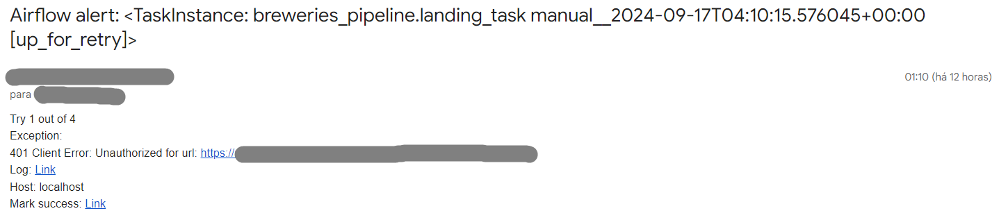

# Error handling, alerts, and monitoring

## On Apache Spark

Apache Spark can handle potential task errors and generate email alerts within
the tool itself. It is also possible to track the progress of DAGs on the Webserver.

In the DAG argument configuration:

```shell
default_args = {
    'start_date':datetime(2024, 9, 15),
    'email_on_failure':True,
    'email_on_retry':True,
    'email':['email@email.com'],
    'retries':3,
    'retry_delay':timedelta(minutes=1)}
```

We can define:
`start_date` - Start date for task execution;

`email_on_failure` - Option to send an alert email in case of failure;

`email_on_retry` - Option to send an alert email in case of retry;

`email` - Destination email for sending alerts in case of failure, example:



`retries` - The maximum number of attempts to execute the task;

`retry_delay` - The interval between attempts to execute the task;

Note that, to send alert emails, you need to enable SMTP settings in
`airflow.cfg` and set your configurations in the `.env` file.

## Other ideas for monitoring and alerts

To further enhance our DAG and task monitoring, we can use external tools like
Prometheus and Grafana. It is possible to export data from the Airflow
environment to Prometheus via an exporter and connect it to Grafana to create
customized dashboards for general task and DAG monitoring. Alerts can also be
created for both failures and processing.
